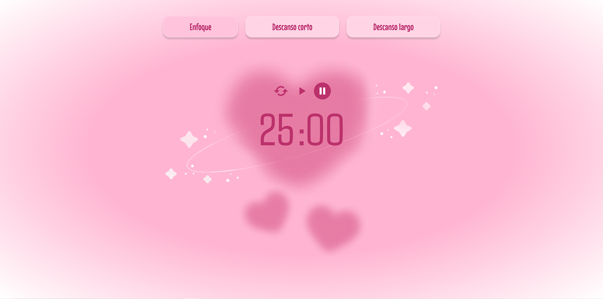

# 💖 Aura Pomodoro

**Mi Pomodoro** Aura pomodoro es una aplicación web diseñada para mejorar la productividad mediante la técnica Pomodoro. Con un diseño cute inspirado en tonos pastel y corazones, esta herramienta permite a los usuarios gestionar sus sesiones de trabajo y descanso de manera eficiente.

### 🌐 Demo 🌐

_Puedes ver la demostración del proyecto en el siguiente enlace_

-   [Demo]([aura-pomodoro.vercel.app](https://aura-pomodoro.vercel.app/))

## 🛠️ **Tecnologías utilizadas**

-   **HTML5**: Estructura semántica y organizada.
-   **JavaScript (ES6+)**: Interactividad y lógica del temporizador.
-   **React**: Construcción de componentes y manejo del estado.
-   **Tailwind CSS**: estilización rápida.
-   **Zustand**: Manejo del estado de la aplicación.

## ✨ **Características principales**

    -   Temporizador Pomodoro de 25 minutos ⏰
    -   Interfaz amigable con colores pastel y corazones 💕
    -   Iconos personalizados con Boxicons 🎭
    -   Manejo de estado eficiente con Zustand ⚡

## 🔜 **Próximas mejoras**

    -   El usuario proximamente podra escojer su tiempo de estudio y descanso
    -   habran mas tonos de alarma al terminar el pomodoro

_Hecho con 💕 por Dulce._
